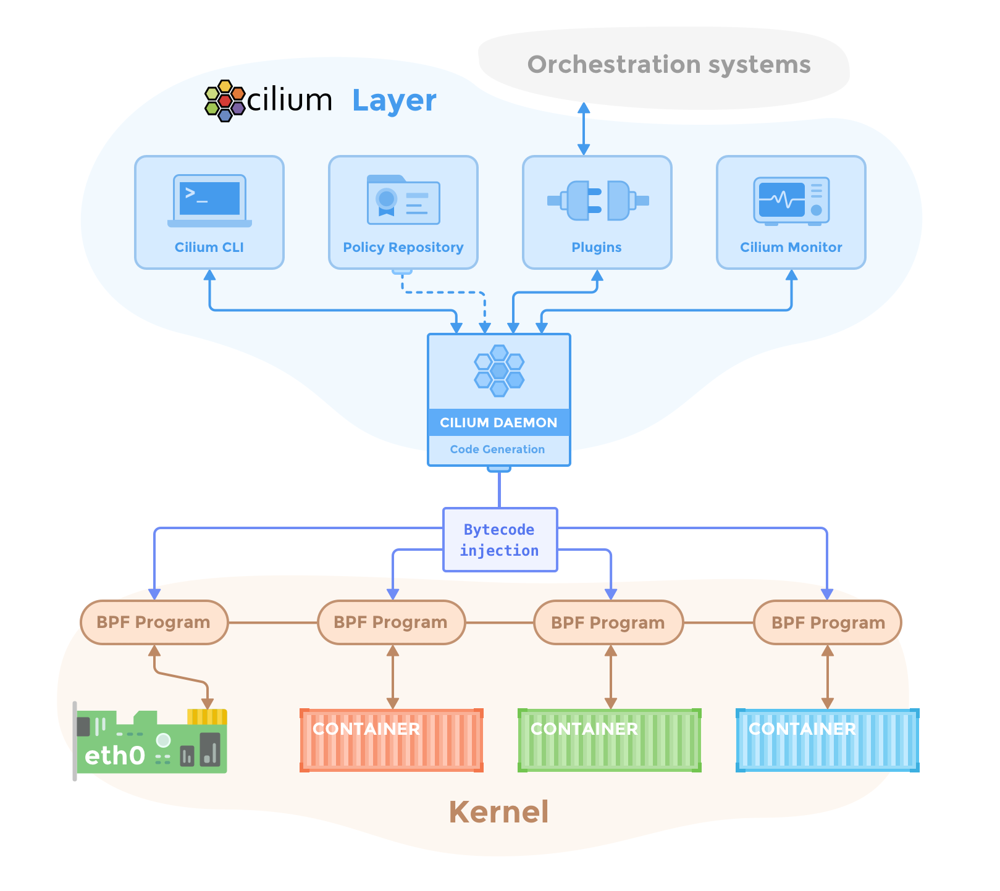

# Cilium

[Cilium ](https://github.com/cilium/cilium)是一个基于 eBPF 和 XDP 的高性能容器网络方案，代码开源在 [https://github.com/cilium/cilium](https://github.com/cilium/cilium)。其主要功能特性包括

* 安全上，支持 L3/L4/L7 安全策略，这些策略按照使用方法又可以分为
  * 基于身份的安全策略（security identity）
  * 基于 CIDR 的安全策略
  * 基于标签的安全策略
* 网络上，支持三层平面网络（flat layer 3 network），如
  * 覆盖网络（Overlay），包括 VXLAN 和 Geneve 等
  * Linux 路由网络，包括原生的 Linux 路由和云服务商的高级网络路由等
* 提供基于 BPF 的负载均衡
* 提供便利的监控和排错能力



## eBPF 和 XDP

eBPF（extended Berkeley Packet Filter）起源于BPF，它提供了内核的数据包过滤机制。BPF的基本思想是对用户提供两种SOCKET选项：`SO_ATTACH_FILTER`和`SO_ATTACH_BPF`，允许用户在sokcet上添加自定义的filter，只有满足该filter指定条件的数据包才会上发到用户空间。`SO_ATTACH_FILTER`插入的是cBPF代码，`SO_ATTACH_BPF`插入的是eBPF代码。eBPF是对cBPF的增强，目前用户端的tcpdump等程序还是用的cBPF版本，其加载到内核中后会被内核自动的转变为eBPF。Linux 3.15 开始引入 eBPF。其扩充了 BPF 的功能，丰富了指令集。它在内核提供了一个虚拟机，用户态将过滤规则以虚拟机指令的形式传递到内核，由内核根据这些指令来过滤网络数据包。


XDP（eXpress Data Path）为Linux内核提供了高性能、可编程的网络数据路径。由于网络包在还未进入网络协议栈之前就处理，它给Linux网络带来了巨大的性能提升。XDP 看起来跟 DPDK 比较像，但它比 DPDK 有更多的优点，如

* 无需第三方代码库和许可
* 同时支持轮询式和中断式网络
* 无需分配大页
* 无需专用的CPU
* 无需定义新的安全网络模型

当然，XDP的性能提升是有代价的，它牺牲了通用型和公平性：（1）不提供缓存队列（qdisc），TX设备太慢时直接丢包，因而不要在RX比TX快的设备上使用XDP；（2）XDP程序是专用的，不具备网络协议栈的通用性。

## 部署

版本要求

* Linux Kernel &gt;= 4.8 （推荐 4.9.17 LTS）
* KV 存储（etcd &gt;= 3.1.0 或 consul &gt;= 0.6.4）

### Kubernetes Cluster

```bash
# mount BPF filesystem on all nodes
$ mount bpffs /sys/fs/bpf -t bpf

$ wget https://raw.githubusercontent.com/cilium/cilium/doc-1.0/examples/kubernetes/1.10/cilium.yaml
$ vim cilium.yaml
[adjust the etcd address]

$ kubectl create -f ./cilium.yaml
```

### minikube

```bash
minikube start --network-plugin=cni --bootstrapper=localkube --memory=4096 --extra-config=apiserver.Authorization.Mode=RBAC
kubectl create clusterrolebinding kube-system-default-binding-cluster-admin --clusterrole=cluster-admin --serviceaccount=kube-system:default
kubectl create -f https://raw.githubusercontent.com/cilium/cilium/HEAD/examples/kubernetes/addons/etcd/standalone-etcd.yaml
kubectl create -f https://raw.githubusercontent.com/cilium/cilium/HEAD/examples/kubernetes/1.10/cilium.yaml
```

### Istio

```bash
# cluster clusterrolebindings
kubectl create clusterrolebinding kube-system-default-binding-cluster-admin --clusterrole=cluster-admin --serviceaccount=kube-system:default
# etcd
kubectl create -f https://raw.githubusercontent.com/cilium/cilium/HEAD/examples/kubernetes/addons/etcd/standalone-etcd.yaml

# cilium
curl -s https://raw.githubusercontent.com/cilium/cilium/HEAD/examples/kubernetes/1.10/cilium.yaml | \
  sed -e 's/sidecar-http-proxy: "false"/sidecar-http-proxy: "true"/' | \
  kubectl create -f -

# Istio
curl -L https://git.io/getLatestIstio | sh -
ISTIO_VERSION=$(curl -L -s https://api.github.com/repos/istio/istio/releases/latest | jq -r .tag_name)
cd istio-${ISTIO_VERSION}
cp bin/istioctl /usr/local/bin

# Patch with cilium pilot
sed -e 's,docker\.io/istio/pilot:,docker.io/cilium/istio_pilot:,' \
      < install/kubernetes/istio.yaml | \
      kubectl create -f -

# Configure Istio’s sidecar injection to use Cilium’s Docker images for the sidecar proxies
kubectl create -f https://raw.githubusercontent.com/cilium/cilium/HEAD/examples/kubernetes-istio/istio-sidecar-injector-configmap-release.yaml
```

## 安全策略

TCP 策略：

```yaml
apiVersion: "cilium.io/v2"
kind: CiliumNetworkPolicy
description: "L3-L4 policy to restrict deathstar access to empire ships only"
metadata:
  name: "rule1"
spec:
  endpointSelector:
    matchLabels:
      org: empire
      class: deathstar
  ingress:
  - fromEndpoints:
    - matchLabels:
        org: empire
    toPorts:
    - ports:
      - port: "80"
        protocol: TCP
```

CIDR 策略

```yaml
apiVersion: "cilium.io/v2"
kind: CiliumNetworkPolicy
metadata:
  name: "cidr-rule"
spec:
  endpointSelector:
    matchLabels:
      app: myService
  egress:
  - toCIDR:
    - 20.1.1.1/32
  - toCIDRSet:
    - cidr: 10.0.0.0/8
      except:
      - 10.96.0.0/12
```

L7 HTTP 策略：

```bash
apiVersion: "cilium.io/v2"
kind: CiliumNetworkPolicy
description: "L7 policy to restrict access to specific HTTP call"
metadata:
  name: "rule1"
spec:
  endpointSelector:
    matchLabels:
      org: empire
      class: deathstar
  ingress:
  - fromEndpoints:
    - matchLabels:
        org: empire
    toPorts:
    - ports:
      - port: "80"
        protocol: TCP
      rules:
        http:
        - method: "POST"
          path: "/v1/request-landing"
```

## 监控

[microscope](https://github.com/cilium/microscope) 汇集了所有 Nodes 的监控数据（从 `cilium monitor` 获取）。使用方法为：

```bash
$ kubectl apply -f
https://github.com/cilium/microscope/blob/master/docs/microscope.yaml
$ kubectl exec -n kube-system microscope -- microscope -h
```

## 参考资料

* [Cilium documentation](http://cilium.readthedocs.io/)

