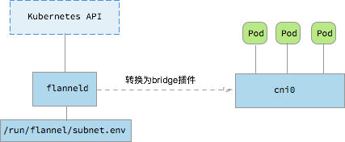

# Flannel

[Flannel](https://github.com/coreos/flannel)通过给每台宿主机分配一个子网的方式为容器提供虚拟网络，它基于Linux TUN/TAP，使用UDP封装IP包来创建overlay网络，并借助etcd维护网络的分配情况。

## Flannel原理

控制平面上host本地的flanneld负责从远端的ETCD集群同步本地和其它host上的subnet信息，并为POD分配IP地址。数据平面flannel通过Backend（比如UDP封装）来实现L3 Overlay，既可以选择一般的TUN设备又可以选择VxLAN设备。

```javascript
{
    "Network": "10.0.0.0/8",
    "SubnetLen": 20,
    "SubnetMin": "10.10.0.0",
    "SubnetMax": "10.99.0.0",
    "Backend": {
        "Type": "udp",
        "Port": 7890
    }
}
```


除了UDP，Flannel还支持很多其他的Backend：

* udp：使用用户态udp封装，默认使用8285端口。由于是在用户态封装和解包，性能上有较大的损失
* vxlan：vxlan封装，需要配置VNI，Port（默认8472）和[GBP](https://github.com/torvalds/linux/commit/3511494ce2f3d3b77544c79b87511a4ddb61dc89)
* host-gw：直接路由的方式，将容器网络的路由信息直接更新到主机的路由表中，仅适用于二层直接可达的网络
* aws-vpc：使用 Amazon VPC route table 创建路由，适用于AWS上运行的容器
* gce：使用Google Compute Engine Network创建路由，所有instance需要开启IP forwarding，适用于GCE上运行的容器
* ali-vpc：使用阿里云VPC route table 创建路由，适用于阿里云上运行的容器

## Docker集成

```bash
source /run/flannel/subnet.env
docker daemon --bip=${FLANNEL_SUBNET} --mtu=${FLANNEL_MTU} &
```

## CNI集成

CNI flannel插件会将flannel网络配置转换为bridge插件配置，并调用bridge插件给容器netns配置网络。比如下面的flannel配置

```javascript
{
    "name": "mynet",
    "type": "flannel",
    "delegate": {
        "bridge": "mynet0",
        "mtu": 1400
    }
}
```

会被cni flannel插件转换为

```javascript
{
    "name": "mynet",
    "type": "bridge",
    "mtu": 1472,
    "ipMasq": false,
    "isGateway": true,
    "ipam": {
        "type": "host-local",
        "subnet": "10.1.17.0/24"
    }
}
```

## Kubernetes集成

使用flannel前需要配置`kube-controller-manager --allocate-node-cidrs=true --cluster-cidr=10.244.0.0/16`。

```bash
kubectl apply -f https://raw.githubusercontent.com/coreos/flannel/master/Documentation/kube-flannel.yml
```

这会启动flanneld容器，并配置CNI网络插件：

```bash
$ ps -ef | grep flannel | grep -v grep
root      3625  3610  0 13:57 ?        00:00:00 /opt/bin/flanneld --ip-masq --kube-subnet-mgr
root      9640  9619  0 13:51 ?        00:00:00 /bin/sh -c set -e -x; cp -f /etc/kube-flannel/cni-conf.json /etc/cni/net.d/10-flannel.conf; while true; do sleep 3600; done

$ cat /etc/cni/net.d/10-flannel.conf
{
  "name": "cbr0",
  "type": "flannel",
  "delegate": {
    "isDefaultGateway": true
  }
}
```



flanneld自动连接kubernetes API，根据`node.Spec.PodCIDR`配置本地的flannel网络子网，并为容器创建vxlan和相关的子网路由。

```bash
$ cat /run/flannel/subnet.env
FLANNEL_NETWORK=10.244.0.0/16
FLANNEL_SUBNET=10.244.0.1/24
FLANNEL_MTU=1410
FLANNEL_IPMASQ=true

$ ip -d link show flannel.1
12: flannel.1: <BROADCAST,MULTICAST,UP,LOWER_UP> mtu 1410 qdisc noqueue state UNKNOWN mode DEFAULT group default
    link/ether 8e:5a:0d:07:0f:0d brd ff:ff:ff:ff:ff:ff promiscuity 0
    vxlan id 1 local 10.146.0.2 dev ens4 srcport 0 0 dstport 8472 nolearning ageing 300 udpcsum addrgenmode eui64
```


## 优点

* 配置安装简单，使用方便
* 与云平台集成较好，VPC的方式没有额外的性能损失

## 缺点

* VXLAN模式对zero-downtime restarts支持不好

> When running with a backend other than udp, the kernel is providing the data path with flanneld acting as the control plane. As such, flanneld can be restarted \(even to do an upgrade\) without disturbing existing flows. However in the case of vxlan backend, this needs to be done within a few seconds as ARP entries can start to timeout requiring the flannel daemon to refresh them. Also, to avoid interruptions during restart, the configuration must not be changed \(e.g. VNI, --iface values\).

**参考文档**

* [https://github.com/coreos/flannel](https://github.com/coreos/flannel)
* [https://coreos.com/flannel/docs/latest/](https://coreos.com/flannel/docs/latest/)

